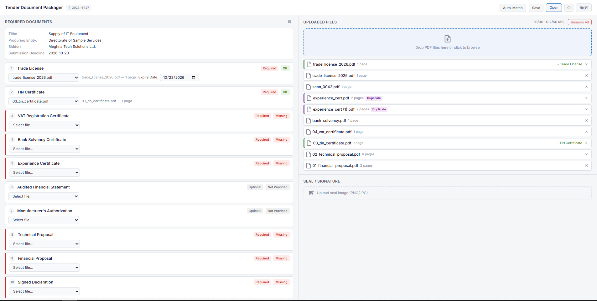

# Tender Document Packager

**🔗 [Live Demo](https://hackathon-aidevfest-2026.vercel.app/)**

## The Problem
When organizations invite companies to compete for a tender, bidders must submit a specific set of required documents such as trade licenses, TIN and VAT certificates, bank solvency letters, experience certificates, and technical/financial proposals. Preparing this package manually is prone to errors like missing, expired, duplicated, or misplaced documents, which can lead to bid rejection.

## The Solution
This web application acts as a smart compiler. It helps users seamlessly turn a set of raw PDF files into a complete, correctly ordered, and verified PDF package ready for submission.

## Preview


## Key Features

- **Requirements Loading:** Load tender requirements via a `requirements.json` file.
- **Bulk PDF Upload:** Support for bulk uploading PDF files with automatic validation.
- **Document Matching:** Match uploaded files to required documents. Supports auto-matching based on filenames and AI-assisted matching.
- **Validation & Expiry:** Real-time validation for missing or expired documents based on the tender's submission deadline.
- **Duplicate Detection:** Identifies uploaded files with identical content to prevent accidental duplicate assignments.
- **PDF Generation:** Generates a unified PDF package including:
  - A cover page with tender details and an index.
  - Ordered document pages.
  - Custom footers (`<tender_id> | Page X of Y`).
  - Custom seal/signature placement.
- **Bilingual Interface:** Toggle between English and Bangla.
- **Session Persistence:** Save and reopen workspace state.
- **Export:** Export the document checklist as CSV.

## Technical Details

- **Local & Secure Processing:** Built with **React** and **Vite**. The application performs all heavy lifting directly in the browser. No files are uploaded to any external server (except for metadata during AI-assisted matching, which requires a user-provided API key).
- **Client-side PDF Manipulation:** Uses `pdf-lib` to load, merge, and paginate multiple PDFs on the fly. We inject custom footers (with the tender ID and pagination) and dynamically generate a cover and index page without relying on a backend.
- **File Validation & Hashing:** Implemented custom array buffer reading to validate PDF magic bytes (`%PDF-`), detect corrupt or password-protected files, and hash file contents for instant duplicate detection before processing.
- **State Management & Persistence:** Project state (including matched documents and expiry dates) is serialized and can be auto-saved or downloaded as a `.tdp` backup file, allowing users to safely pause and resume their workspace.
- **Zero-Dependency Styling:** Built using vanilla CSS to maintain absolute control over the UI, ensuring a lightweight footprint without reliance on external utility frameworks.

## Setup and Installation

1. Install dependencies:
   ```bash
   npm install
   ```

2. Run the development server:
   ```bash
   npm run dev
   ```

3. Build for production:
   ```bash
   npm run build
   ```

## Usage Guidelines

1. **Load Requirements:** Upload the `requirements.json` file.
2. **Upload Documents:** Upload the required PDF files.
3. **Match & Validate:** Match uploaded files to their respective requirements. Enter expiry dates where required. Use auto-match or AI-match to speed up the process.
4. **Generate Package:** Once all requirements are fulfilled, click the "Generate Package" button.
5. **Download:** Download the finalized `<tender_id>_Package.pdf`.

## Constraints
- **Limits:** Supports up to 30 PDF files and 50 MB total file size limit.
